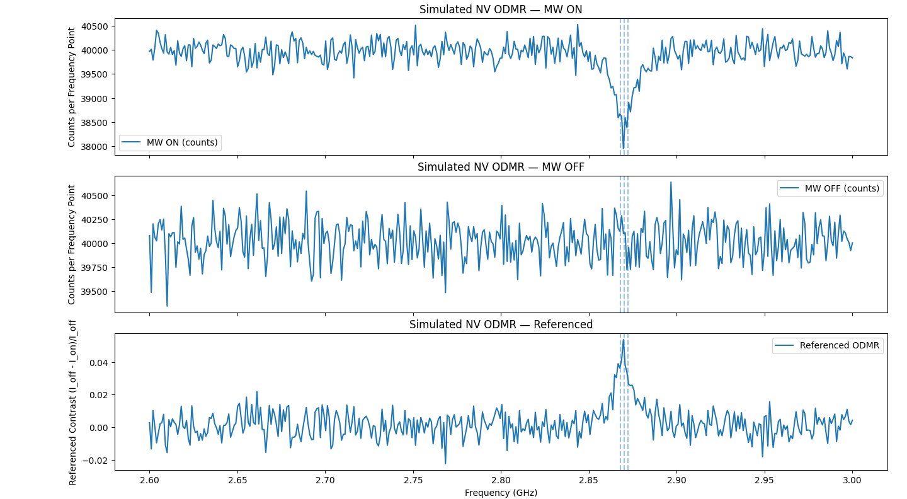
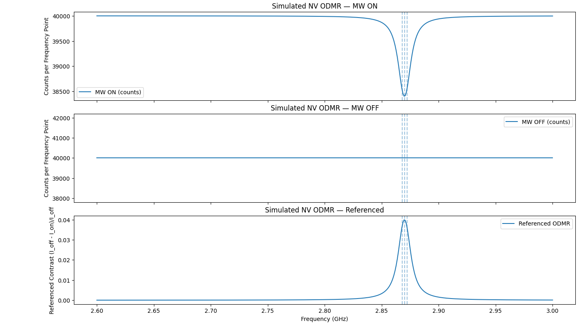
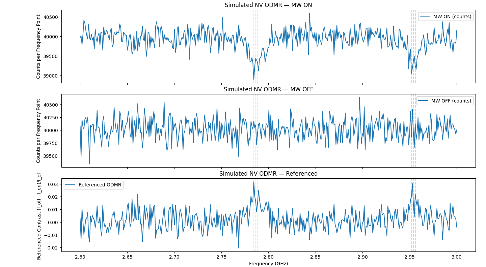
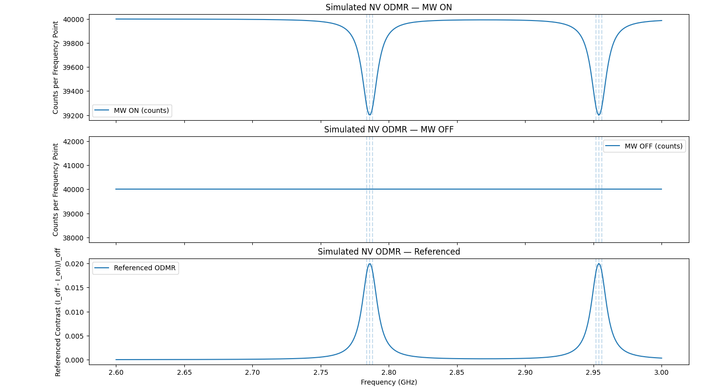

# NV ODMR Simulator for Quantum Sensing Experiments

Fast, realistic **CW-ODMR** simulator for NV centers. Supports Lorentzian lines, ^14N hyperfine triplets, power broadening, Poisson shot noise, and clear referenced output — perfect for teaching, demos, and quick UI testing.

- **Main script:** `nv_odmr_simulator.py`
- **Core idea:** Two Lorentzian notches at $f_{\pm} \approx D \pm \gamma_e B_{\parallel}$ with optional hyperfine triplets. Width: $\mathrm{FWHM}=\mathrm{FWHM}_0\sqrt{1+s}$ (with $s$ the saturation parameter); depth (on resonance): $C_{\text{on}} = C_{\max}\frac{s}{1+s}$.


---

## Features
- **Two-line ODMR** at \(D \pm \gamma_e B_\parallel\)
- **^14N hyperfine triplets** (2.16 MHz) with **peak-normalized** triplet so contrast semantics stay consistent
- **Power broadening**: \(\mathrm{FWHM} = \mathrm{FWHM}_0\sqrt{1+s}\) (here `power_fac ≈ s`)
- **Power-dependent depth** (optional): \(C_\text{on} = C_\max \dfrac{s}{1+s}\)
- **Poisson shot noise** (toggle with `use_noise`)
- **Referenced signal**: \((I_\text{off} - I_\text{on})/I_\text{off}\) cancels baseline/gain

---

## Gallery
- **One dip, noisy**  
  

- **One dip, clean**  
  

- **Two dips, noisy**  
  

- **Two dips, clean**  
  

**How to generate:**
- *One dip:* set `B_mag = 0.0` (Tesla)
- *Two dips:* set `B_mag ≈ 2e-3` to `3e-3` (Tesla) with `theta = 0`  
  Separation \(\Delta f \approx 2\gamma_e B_\parallel\).  
- *Noise on/off:* toggle `use_noise = True/False`

---

## Quickstart
1. Install required libraries:
   ```bash
   pip install numpy matplotlib
   ```

2. Run the script:
   ```bash
   python nv_odmr_simulator.py
   ```

3. Edit the top-of-file parameters to explore:
   - **Magnetic field:** `B_mag` (Tesla) & `theta` (deg)
   - **Line width:** `fwhm0` (Hz) & `power_fac` (dimensionless proxy for saturation parameter \(s\))
   - **Hyperfine:** `hyperfine_on` & `A_PARALLEL` (Hz)
   - **Noise / integration:** `use_noise`, `cps`, `read_time`, `frames`, `averages`

---

## What the plots show
- **MW ON (counts):** raw fluorescence with resonant depletion (dips)
- **MW OFF (counts):** baseline counts without resonant depletion
- **Referenced (unitless):** \((I_\text{off} - I_\text{on})/I_\text{off}\) → directly shows fractional contrast vs frequency

> Tip: If ON/OFF look too noisy in a live demo, increase  `averages`, `frames` or `read_time`, or set `use_noise=False` for a clean illustration.

---

## Parameter Cheat Sheet
| Param | Meaning | Typical |
|---|---|---|
| `f_start`, `f_end`, `dynamic_steps` | Frequency sweep (Hz) and resolution | 2.60e9–3.00e9, 400–801 steps |
| `D_mag` | Zero-field splitting \(D\) (Hz) | 2.870e9 |
| `gamma_e` | Gyromagnetic ratio (Hz/T) | 28e9 |
| `B_mag`, `theta` | Field magnitude (T) and angle (deg) | 0.0–3e-3, 0–90 |
| `A_PARALLEL` | ^14N hyperfine splitting \(A_\parallel\) (Hz) | 2.16e6 |
| `hyperfine_on` | Toggle triplets | True/False |
| `fwhm0` | Low-power FWHM (Hz) \(\approx 1/(\pi T_2)\) | 5e6–15e6 |
| `power_fac` | Saturation parameter proxy \(s\) (dimensionless) | 0–5 |
| `C_max` | Max contrast at high power | 0.02–0.06 |
| `baseline_slope` | Linear tilt per GHz (unitless) | 0–0.02 |
| `cps` | Counts per second (baseline brightness) | 1e5–1e6 |
| `read_time`, `frames`, `averages` | Integration controls | ↑ → less noise |
| `use_noise` | Poisson noise toggle | True/False |

**Derived knobs**
- **Centers:** \(f_\pm = D \pm \gamma_e B_\parallel\), with \(B_\parallel = B\cos\theta\).  
- **Width:** \(\mathrm{FWHM} = \mathrm{FWHM}_0\sqrt{1+s}\) with \(s \approx\) `power_fac`.  
- **Depth:** \(C_\text{on} = C_\max \dfrac{s}{1+s}\) (use fixed contrast if you prefer).

---

## Theory-in-one-minute
- Laser pumping makes \(|0\rangle\) **bright**; \(|\pm1\rangle\) are **dimmer**.  
- On resonance, MW drives \(|0\rangle \leftrightarrow |\pm1\rangle\) → fewer photons → a **dip**.  
- Steady-state OBE ⇒ **Lorentzian** response in frequency; width set by \(T_2\) and power; depth saturates with power.  
- Hyperfine (\(I=1\)) splits each line into a **triplet** at \(\pm A_\parallel\).

---

## SNR / Sampling Tips
- Expected counts per point: `I0_total = cps * read_time * frames * averages`  
- Referenced noise (shot-noise limit): \(\sigma_\text{ref} \approx \sqrt{2 / I0\_total}\)  
- Aim for **SNR** \(=\) peak contrast / \(\sigma_\text{ref}\) ≥ 5 for nice plots.  
- Frequency resolution: \(\mathrm{df} = \dfrac{f_\text{end}-f_\text{start}}{\text{steps}-1}\). Target **≥ 8–10 points per FWHM**.

---

## Reproduce the gallery
**One dip (B=0), noisy & clean**
```python
B_mag = 0.0; use_noise = True   # noisy
# B_mag = 0.0; use_noise = False  # clean
```

**Two dips (B≈2 mT), noisy & clean**
```python
B_mag = 3e-3; theta = 0; use_noise = True    # noisy
# B_mag = 3e-3; theta = 0; use_noise = False # clean
```
---
